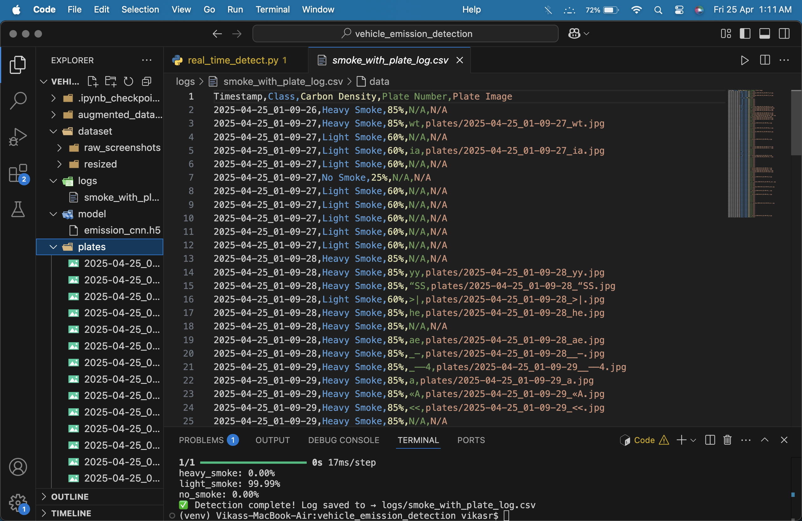

# 🚗 Vehicle Emission Detection with Number Plate Recognition

A real-time computer vision project that detects smoke emissions from vehicles using a CNN model and extracts number plates using OCR.

---

## 🧠 Features

- 🔍 Detects **No Smoke**, **Light Smoke**, or **Heavy Smoke**
- 📸 Captures and saves **vehicle number plates**
- 📈 Logs detection data with timestamp, class, carbon density %, and plate image
- 💾 Saves results to a CSV file (`logs/smoke_with_plate_log.csv`)
- 🎨 Displays real-time detection with colored labels:
  - 🟢 No Smoke
  - 🟡 Light Smoke
  - 🔴 Heavy Smoke

---

## 🛠️ Tech Stack

- Python
- OpenCV
- TensorFlow / Keras
- Tesseract OCR
- NumPy
- CSV Logging

---

## 📊 Carbon Density Levels

| Class        | Carbon Density | Displayed Color |
|--------------|----------------|-----------------|
| No Smoke     | 0% - 50%       | 🟢 Green         |
| Light Smoke  | 51% - 70%      | 🟡 Yellow        |
| Heavy Smoke  | 71% - 100%     | 🔴 Red           |

---

## 🖼️ Sample Logs

The detection logs are saved in `logs/smoke_with_plate_log.csv` and include:

- **Timestamp**
- **Class** (No/Light/Heavy Smoke)
- **Carbon Density (%)**
- **Plate Number**
- **Plate Image Path**




---

## 🚀 How to Run

1. Clone this repo:
   ```bash
   git clone https://github.com/yourusername/vehicle_emission_detection.git
   cd vehicle_emission_detection
